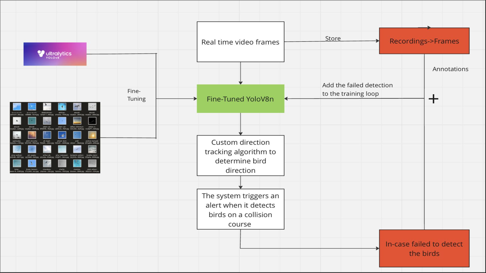

# Fly High - Real time bird detection and tracking

- Prevent bird collisions into wind turbines or airplanes that are landing/taking off
- Utilizes YOLO v8 model to detect the birds and use this information to get the birds direction of flight using a custom tracking algorithm. 

